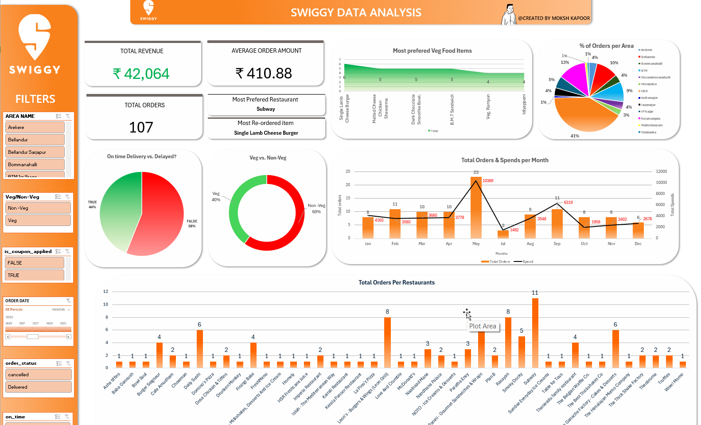
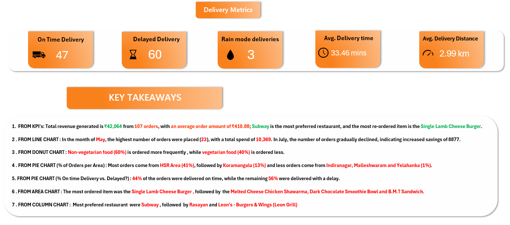

# Swiggy Order & Customer Behavior Analysis

An interactive **Excel dashboard project** analyzing Swiggy order trends, customer preferences, restaurant performance, and delivery efficiency to derive actionable business insights.

---

## 📌 Project Overview

This project focuses on **Swiggy Order & Customer Behavior Analysis**, where I built an interactive Excel dashboard to analyze:

- Order trends
- Customer food preferences
- Restaurant performance
- Delivery efficiency
- Monthly revenue patterns

The dataset contains order-level details such as:

- Order ID
- Restaurant name
- Food item
- Veg / Non-Veg category
- Order status
- Delivery time
- Delivery distance
- Cancellation count
- Monthly spending
- Revenue generated

This analysis helps identify customer behavior patterns and provides insights that can improve **operational efficiency, customer satisfaction, and revenue growth**.

---

## 🎯 Business Objective

The main objective of this project is to understand:

- How many orders are placed
- How much revenue is generated
- Which food types are most preferred
- Which restaurants are most popular
- Whether deliveries are happening on time
- What factors influence customer loyalty and repeat orders

Using the dashboard, I analyzed:

- Monthly spending trends
- Order frequency
- Delivery delays
- Cancellations
- Top-performing restaurants
- Top-performing food items

---

## 📊 Dataset Overview

The dataset includes restaurant-level, food-item-level, and area-level data, allowing detailed analysis of:

- Ordering patterns
- Customer preferences
- Delivery performance
- Revenue generation

---

## 🛠 Tools & Techniques Used

- **Microsoft Excel**
- **Data Cleaning & Transformation**
- **XLOOKUP & VLOOKUP**
- **Pivot Tables & Pivot Charts**
- **KPI Metrics**
- **Interactive Dashboard with Slicers**
- **Handling Missing Values**
- **Standardizing Food Categories & Restaurant Areas**

---

## 🧩 Project Workflow

1. Imported raw Swiggy order data into Excel  
2. Cleaned and transformed the data  
3. Used **XLOOKUP** and **VLOOKUP** to merge food item-level and restaurant area data  
4. Created Pivot Tables for analysis  
5. Built Pivot Charts for visual storytelling  
6. Calculated KPIs such as:
   - Total Orders
   - Total Revenue
   - Average Order Value
   - Delivery Performance
7. Designed an interactive dashboard using slicers, charts, and summary cards  

---

## 🔍 Key Insights

- **107 total orders** generated **₹42,064 revenue**
- **Average order value:** **₹410.88**
- **Non-Veg food** dominates customer demand
- **Subway** emerged as the most preferred restaurant
- **Single Lamb Cheese Burger** is the most frequently reordered item
- **60 out of 107 orders** were delayed
- **Average delivery time:** **33.4 minutes**
- **Average delivery distance:** **3 km**
- Only **3 orders** were cancelled
- Monthly revenue shows **significant fluctuations**, suggesting seasonal or behavioral ordering patterns

---

## 💡 Recommendations

- Promote **Subway** and other top-performing restaurants to increase repeat orders
- Highlight **Single Lamb Cheese Burger** and similar high-demand items in marketing campaigns
- Improve **delivery route optimization** and partner efficiency to reduce delays
- Run **targeted offers and campaigns** during low-performing months to stabilize revenue
- Strengthen partnerships with top vendors to improve customer retention and overall sales

---

## 📈 Dashboard Preview

### 🎥 Project GIF


### 📸 Dashboard Screenshot


### 🧠 Key Findings


---

## 📂 Repository Structure

```bash
Swiggy-Order-Analysis/
├── Images/
│   ├── Key_Findings.png
│   ├── swiggy.gif
│   └── swiggy.png
└── README.md
```
---

## 📢 Conclusion

This project demonstrates how Excel dashboards can transform raw food delivery data into meaningful business insights.  
By analyzing order patterns, customer preferences, and delivery performance, we can identify opportunities to improve:

- Customer satisfaction
- Delivery efficiency
- Revenue growth
- Restaurant partnerships


---

## 👤 Author

**Moksh Kapoor**  
Aspiring Data Analyst  

<p>
  🔗 <strong>LinkedIn:</strong> 
  <a href="https://www.linkedin.com/in/moksh-kapoor-618495322/" target="_blank" style="text-decoration:none; color:#0A66C2; font-weight:bold;">
    Visit My LinkedIn Profile
  </a>
</p>

📢 You can also check this project on my LinkedIn post: 
<a href="https://www.linkedin.com/posts/moksh-kapoor-618495322_dataanalytics-exceldashboard-dataanalysis-activity-7437406043053113344-pnWc?utm_source=share&utm_medium=member_desktop&rcm=ACoAAFGVzjQBQzKnpNzkuOZayyyvYW4FkHnrf28" target="_blank">
View Post 🚀
</a>

If you like this project, ⭐ **give it a star** on GitHub to show your support!
